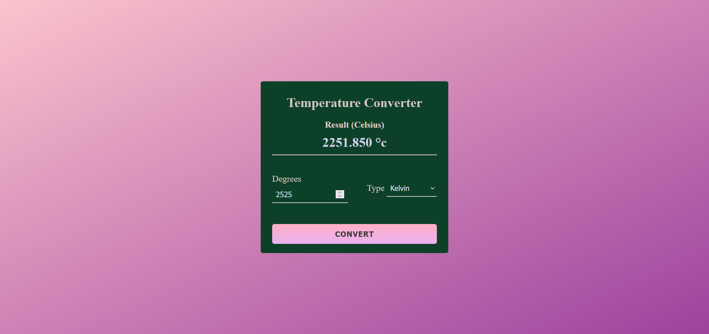

Certainly! Below is a simple template for your README.md file. Feel free to modify and customize it based on your preferences.

```markdown
# Temperature Converter App

A simple temperature converter web application built with HTML, CSS, and JavaScript.

## Overview

This temperature converter allows users to input a temperature value in Fahrenheit or Kelvin and converts it to Celsius. The application features a responsive design and an aesthetically pleasing color scheme.

## Features

- Convert temperature from Fahrenheit to Celsius
- Convert temperature from Kelvin to Celsius
- Responsive design for various screen sizes
- Clean and user-friendly interface

## How to Use

1. Open the `index.html` file in your web browser.
2. Enter the temperature value in the "Degrees" input field.
3. Choose the temperature type (Fahrenheit or Kelvin) from the dropdown menu.
4. Click the "Convert" button to see the converted temperature in Celsius.

## Screenshots



## Demo

You can view a live demo of the application [here](index.html).

## Getting Started

To run the application locally, follow these steps:

1. Clone this repository:

   ```bash
   git clone https://github.com/your-username/temperature-converter.git
   ```

2. Open the project folder:

   ```bash
   cd temperature-converter
   ```

3. Open `index.html` in your preferred web browser.

## Contributing

Contributions are welcome! If you find any bugs or have suggestions for improvement, please open an issue or submit a pull request.

## License

This project is licensed under the [MIT License](LICENSE).

## Acknowledgements

- The project was inspired by the need for a simple and functional temperature converter.
- Special thanks to [OpenAI](https://www.openai.com/) for providing the GPT-3.5 model used for creating this README.

```
